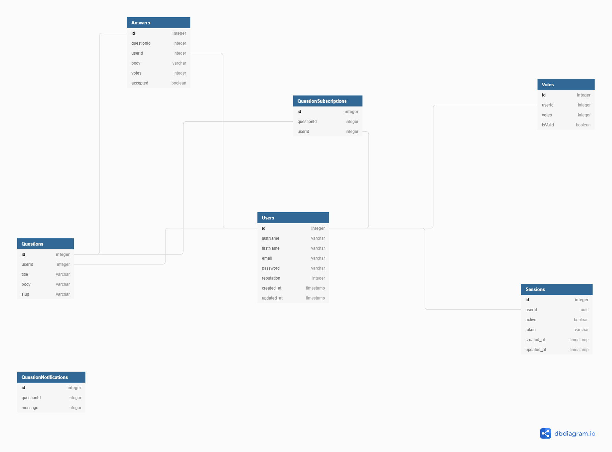

# Stack Overflow clone

An API clone of stackoverflow containing basic features (listed below)

[](https://github.com/prettier/prettier)

## Brief Description

This is a simple StackOverflow API clone with the following functionalities:

- Authentication (create/destroy session)
- User registration
- Questions (ASk & Answer questions)
- Upvote/Downvote a question
- Subscribe to a question
- Get a question (and its answers)

## Architecture

This project was built following the [Clean Architecture](https://blog.cleancoder.com/uncle-bob/2012/08/13/the-clean-architecture.html) by Robert C. Martin, which is summarized in the diagram below:


## Assumptions made

The following assumpetions were made during the implementation of this project:

- Anyone can registr on the platform
- Only a registered user can ask/answer questions
- Only a registered user can upvote/downvote a question
- A registered user that asks a qestion is automatically subscribed to receive notifications for that question.
- A registered user can upvote/downvote question for an unlimited number of times (i.e, no limit)

## Entity Relationship Diagram



## Documentation

- [Postman Docs (in progress)](https://www.getpostman.com/collections/e056dbca4f2f44959df6)

## Getting Started

These instructions will get you a copy of the project up and running on your local machine for testing purposes.

### Prerequisites

System requirements for this project to work includes:

- Node.js(v8 or higher)
- Node Package Manager (NPM)
- Git
- Typescript globally installed
- MySQL

### Installation

To install the dependencies in the package.json file, run the following command:

```bash
npm install
```

### Running the project

To run the project on your local machine, follow the steps below:

- Ensure that the MySQL instance on your machine is running.
- Create a database called **stackoverflow_clone** (or any arbitrary name of your choice)
- Populate the environment variables listed in the `env.sample` file (contained in the root folder) with the appropriate values (database credentials included, as listed)

Once the steps above have been taken, navigate to the project directory and run the following commands on the terminal:

```bash
npm run db:migrate
npm run start:dev
```

### Unit & Integration testing

Run the following command

```bash
npm test
```

## Built With

- [Express](https://expressjs.com/) - The Node.js web framework used
- [Typescript](https://www.typescriptlang.org/) the language used
- [MySQL](https://www.mysql.com/) Relational Database Management System used
- [NPM](https://www.npmjs.com/) - Dependency Manager for Node.js
